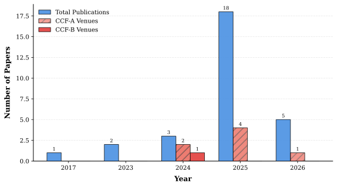

# 😎 Awesome Aerial-Ground Object Re-Identification

[](https://awesome.re)
[](https://github.com/YangQiWei3/Awesome-Aerial-Ground-Object-Re-Identification/graphs/commit-activity)
[](http://makeapullrequest.com)
[](https://opensource.org/licenses/MIT)

A curated list of **Aerial-Ground Object Re-Identification (AG-ReID)** papers, datasets, codebases and challenges.  
AG-ReID aims to match Object across **aerial views** and **ground views**, facing major challenges such as extreme viewpoint discrepancy, scale/resolution variation, illumination changes and background clutter.

> 📩 Feel free to open an issue / PR to add papers, code or datasets.

---

## 📖 Table of Contents
- [🌟 Spotlight: Our Contributions](#-spotlight-our-contributions)
- [📊 Publication Trends](#-publication-trends)
- [📝 Papers & Methods](#-papers--methods)
  - [Image-based Person AG-ReID](#image-based-person-ag-reid)
  - [Image-based Vehicle AG-ReID](#image-based-vehicle-ag-reid)
  - [Video-based Person AG-ReID](#video-based-person-ag-reid)
  - [Challenges & Workshops](#challenges--workshops)
- [💾 Datasets](#-datasets)
- [More Related Exploration](#-more-related-exploration)
- [📈 Star History](#-star-history)
- [🤝 Contributing](#-contributing)
- [🤝 Acknowledgments](#-acknowledgments)
- [📧 Contact](#-contact)
- [📌 Citation](#-citation)

---

## 🌟 Spotlight: Our Contributions

Selected works from our research group on **cross-view alignment** and **robust representation learning**:

- **[WACVW 2026]** SAS-VPReID: A Scale-Adaptive Framework with Shape Priors for Video-based Object Re-Identification at Extreme Far Distances  [Paper](https://arxiv.org/pdf/2601.05535) · [Code](https://github.com/YangQiWei3/SAS-VPReID)

- **[arXiv 2025]** SD-ReID: View-aware Stable Diffusion for Aerial-Ground Object Re-Identification  [Paper](https://arxiv.org/abs/2504.09549)

- **[arXiv 2025]** LATex: Leveraging Attribute-based Text Knowledge for Aerial-Ground Object Re-Identification  [Paper](https://arxiv.org/abs/2503.23722)

> 📩 Feel free to open an issue if you have any questions about our paper.
---


## 📊 Publication Trends
Automatic statistics based on the papers listed in this repository.



---

## 📝 Papers & Methods

### Image-based Person AG-ReID

| Conference / Journal | Method | Title | Resources |
|:---|:---|:---|:---|
| **AAAI 2026** | TAG-CLIP | Text-based Aerial-Ground Object Retrieval | [Paper](https://arxiv.org/pdf/2511.08369) · [Code](https://github.com/Flame-Chasers/TAG-PR)|
| **AAAI 2026** | — | Semantic-Driven Progressive Refinement for Aerial Ground Person ReID: A Challenging Large-Scale Benchmark | Coming Soon |
| **NeurIPS 2025** | GSAlign | Geometric and Semantic Alignment Network for Aerial-Ground Person Re-Identification | [Paper](https://openreview.net/attachment?id=bxELEjg3VE&name=pdf) · [Code](https://github.com/stone96123/GSAlign?tab=readme-ov-file) |
| **ICCV 2025** | VIF | Bridging the Sky and Ground: Towards View-Invariant Feature Learning for Aerial-Ground Person Re-Identification | [Paper](https://openaccess.thecvf.com/content/ICCV2025/html/Khalid_Bridging_the_Sky_and_Ground_Towards_View-Invariant_Feature_Learning_for_ICCV_2025_paper.html) |
| **ArXiv 2025** | SD-ReID | View-aware Stable Diffusion for Aerial-Ground Person Re-Identification | [Paper](https://arxiv.org/abs/2504.09549) |
| **ArXiv 2025** | LATex | Leveraging Attribute-based Text Knowledge for Aerial-Ground Person Re-Identification | [Paper](https://arxiv.org/abs/2503.23722) |
| **ICME 2025** | DTST | Dynamic Token Selective Transformer for  Aerial-Ground Person Re-Identification | [Paper](https://yuhaiw.github.io/DTS-AGPReID/ICMEYuhai.pdf) · [Code](https://github.com/YuhaiW/reidselecttoken) |
| **CVPR 2025** | SeCap | Self-Calibrating and Adaptive Prompts for Cross-view Person Re-Identification in Aerial-Ground Networks | [Paper](https://arxiv.org/abs/2503.06965) · [Code](https://github.com/wangshining681/SeCap-AGPReID) |
| **TOMM 2025** | CVAF | A CLIP-Based View-Consistent Alignment Framework for Aerial-Ground Person Re-Identification | [Paper](https://dl.acm.org/doi/pdf/10.1145/3785482) |
| **ICIG 2025** | PDPA | Perspective Driven Prototype Alignment for Aerial-Ground Person Re-identification | [Paper](https://link.springer.com/chapter/10.1007/978-981-95-3393-0_42) |
| **自动化学报 2025** | — | Implicit Decoder Alignment for Aerial-ground Person Re-identification | [Paper](https://www.aas.net.cn/cn/article/doi/10.16383/j.aas.c240705) |
| **CVPR 2024** | VDT | View-decoupled Transformer for Person Re-identification under Aerial-ground Camera Network | [Paper](https://arxiv.org/abs/2403.14513) · [Code](https://github.com/LinlyAC/VDT-AGPReID?tab=readme-ov-file) |
| **TITS 2024** | AG-ReID.v2 | Bridging Aerial and Ground Views for Person Re-identification | [Paper](https://arxiv.org/abs/2401.02634) · [Code](https://github.com/huynguyen792/AG-ReID.v2) |
| **ICME 2023** | Explain | Aerial-Ground Person Re-ID | [Paper](https://arxiv.org/abs/2303.08597) |
| **ATR 2017** | — | Person Re-Identification Across Aerial and Ground-Based Cameras by Deep Feature Fusion | [Paper](https://publica.fraunhofer.de/bitstreams/ef904224-f31f-484d-b8d2-56695e46779c/download) |

### Image-based Vehicle AG-ReID

| Conference / Journal | Method | Title | Resources |
|:---|:---|:---|:---|
| **SENSORS 2025** | CVNet | Lightweight Cross-View Vehicle ReID with Multi-Scale Localization | [Paper](https://www.mdpi.com/1424-8220/25/9/2809) |
| **RS 2025** | AGID | Aerial-Ground Cross-View Vehicle Re-Identification: A Benchmark Dataset and Baseline | [Paper](https://www.mdpi.com/2072-4292/17/15/2653) |

### Video-based Person AG-ReID

| Conference / Journal | Method | Title | Resources |
|:---|:---|:---|:---|
| **WACVW 2026** | SAS-VPReID | A Scale-Adaptive Framework with Shape Priors for Video-based Person Re-Identification at Extreme Far Distances | [Paper](https://arxiv.org/pdf/2601.05535) · [Code](https://github.com/YangQiWei3/SAS-VPReID) |
| **WACVW 2026** | S3-CLIP | Video Super Resolution for Person-ReID | [Paper](https://arxiv.org/abs/2601.08807) · [Code](https://github.com/TomasDelaney/S3-CLIP) |
| **CVPR 2025** | AG-VPReID | A Challenging Large-Scale Benchmark for Aerial-Ground Video-based Person Re-Identification | [Paper](https://arxiv.org/abs/2503.08121) |
| **IJCB 2025** | VM-TAPS | View-specific Memory with Temporal and Scale Awareness Framework for Video-based Cross-View Person Re-Identification | [Paper](https://www.di.ubi.pt/%7Ehugomcp/doc/rashid_ijcb2025.pdf) · [Code](https://github.com/MdRashidunnabi/VM-TAPS) |
| **TBIOM 2025** | DetReIDX | A Stress-Test Dataset for Real-World UAV-Based Person Recognition | [Paper](https://arxiv.org/pdf/2505.04793) |
| **TBIOM 2025** | MTF–CVReID | Seeing Across Time and Views: Multi-Temporal Cross-View Learning for Robust Video Person Re-Identification | [Paper](https://arxiv.org/pdf/2511.02564) · [Code](https://github.com/MdRashidunnabi/MTF-CVReID) |
| **ECCV 2024** | — | Cross-Platform Video Person ReID: A New Benchmark Dataset and Adaptation Approach | [Paper](https://arxiv.org/abs/2408.07500) · [Code](https://github.com/FHR-L/VSLA-CLIP)  |

---

### Challenges & Workshops

| Conference / Journal | Title | Resources |
|:---|:---|:---|
| **WACV 2026** | VReID-XFD: Video-based Object Re-identification at Extreme Far Distance Challenge Results | [Paper](https://arxiv.org/pdf/2601.01312v1) |
| **IJCB 2025** | AG-VPReID 2025: Aerial-Ground Video-based Object Re-identification Challenge Results | [Paper](https://arxiv.org/pdf/2506.22843) |
| **IJCB 2023** | AG-ReID 2023: Aerial-Ground Object Re-identification Challenge Results | [Paper](https://cvlab.cse.msu.edu/pdfs/IJCB_AG_ReID2023_Challenge_Summary_Paper.pdf) |

---


## 💾 Datasets

| Dataset | Source | Download | Access Code |
| :--- | :--- | :--- | :--- |
| **AG-ReID** | ICME 2023 | [Link](https://drive.google.com/file/d/1hzieEPlXfjkN3V3XWqI5rAwpF_sCF1K9/view) | - |
| **AG-ReID.v2** | TITS 2024 | [Link](https://drive.google.com/drive/folders/16r7G_CuUqfWG6_UCT7goIGRMqJird6vK) | - |
| **CARGO** | CVPR 2024 | [Link](https://drive.google.com/file/d/1yDjyH0VtW7efxP3vgQjIqTx2oafCB67t/view) | - |
| **LAGPeR / G2APS-ReID** | CVPR 2025 | [Link](https://pan.baidu.com/share/init?surl=MRrhqoQzwxw7qOx4Lqdl2g) | - |
| **AG-VPReID** | CVPR 2025 | [Link](https://drive.google.com/drive/folders/1wtdhKzK9Fbj7xkGAM84KNJ1uYCxSMHdj) | - |
| **DetReIDX** | TBIOM 2025 | [Link](https://github.com/kailashhambarde/DetReIDX/tree/main) | - |

---

### More Related Exploration

| Conference / Journal | Title | Resources |
|:---|:---|:---|
| **ArXiv 2025** | Multi-modal Multi-platform Person Re-Identification: Benchmark and Method | [Paper](https://arxiv.org/pdf/2503.17096) · [Code](https://github.com/MP-ReID/mp-reid) · [Dataset](https://drive.google.com/file/d/1hImLEMcsBB2kNV4McGyksVAumLjZQoUU/view) |
| **TCSVT 2025** | AEA-FIRM: Adaptive Elastic Alignment with Fine-Grained Representation Mining for Text-based Aerial Pedestrian Retrieval | [Paper](https://ieeexplore.ieee.org/document/11072214) · [Code](https://github.com/xbdxwyh/AEA-FIRM-main) · [Dataset](https://drive.google.com/file/d/1YYIpBDoJzTIwYRlpWUqEHmpo5GK05S_W/view) |
| **IJCB 2025** | AG-VPReID.VIR: Bridging Aerial and Ground Platforms for Video-based Visible-Infrared Person Re-ID | [Paper](https://arxiv.org/abs/2507.17995) · [Dataset](https://drive.google.com/drive/folders/1Iy814PqWjwIZcv6CZpieFju-Dop9Y2G7) |
| **SPL 2025** | Omni-Directional View Person Re-Identification Through 3D Human Reconstruction | [Paper](https://ieeexplore.ieee.org/stamp/stamp.jsp?tp=&arnumber=10839551) |
| **ACM MM 2024** | AerialGait: Bridging Aerial and Ground Views for Gait Recognition | [Paper](https://dl.acm.org/doi/pdf/10.1145/3664647.3681002) |

---

## 📈 Star History
<picture>
  <source media="(prefers-color-scheme: dark)"
    srcset="https://api.star-history.com/svg?repos=YangQiWei3/Awesome-Aerial-Ground-Object-Re-Identification&type=Date&theme=dark" />
  <source media="(prefers-color-scheme: light)"
    srcset="https://api.star-history.com/svg?repos=YangQiWei3/Awesome-Aerial-Ground-Object-Re-Identification&type=Date" />
  
</picture>


---

## 🤝 Contributing

PRs / Issues are welcome! Please follow these rules:

1. Add your entry to the correct section (Papers / Challenges / Datasets).
2. Keep tables sorted by **Year (desc)**, then **Venue**.
3. Formatting:

   * Venue in **bold** (e.g., `**CVPR 2025**`)
   * Use `—` if method is unknown
   * Resource order: `Paper · Code · Dataset · Project` (only include available links)

**Template**

```markdown
| **VENUE YEAR** | Method | Paper Title | [Paper](link) · [Code](link) · [Dataset](link) · [Project](link) |
```


---

## 🤝 Acknowledgments

We express our sincere gratitude to the academic community and all researchers contributing to the advancement of Aerial-Ground Object Re-Identification.

## 📧 Contact

Questions, suggestions and collaborations are welcome. Please feel free to reach out:

- **Email**: [dutyqw@mail.dlut.edu.cn](mailto:dutyqw@mail.dlut.edu.cn)
- **GitHub**: [Yang Qiwei](https://github.com/YangQiWei3)

## 📌 Citation

If you find our work or this repository useful in your research, please consider citing:

```bibtex
@article{yang2026sas,
  title={SAS-VPReID: A Scale-Adaptive Framework with Shape Priors for Video-based Person Re-Identification at Extreme Far Distances},
  author={Yang, Qiwei and Zhang, Pingping and Wang, Yuhao and Gong, Zijing},
  journal={arXiv preprint arXiv:2601.05535},
  year={2026}
}

@article{wang2025sd,
  title={SD-ReID: View-aware Stable Diffusion for Aerial-Ground Person Re-Identification},
  author={Wang, Yuhao and Hu, Xiang and Wang, Lixin and Zhang, Pingping and Lu, Huchuan},
  journal={arXiv preprint arXiv:2504.09549},
  year={2025}
}

@article{zhang2025latex,
  title={Latex: Leveraging attribute-based text knowledge for aerial-ground person re-identification},
  author={Zhang, Pingping and Hu, Xiang and Wang, Yuhao and Lu, Huchuan},
  journal={arXiv preprint arXiv:2503.23722},
  year={2025}
}

@misc{awesome_agpreid,
  title        = {Awesome Aerial-Ground Object Re-Identification},
  author       = {Yang, Qiwei, Zhang, Pingping and Gong, Zijing},
  howpublished = {\url{https://github.com/YangQiWei3/Awesome-Aerial-Ground-Object-Re-Identification}},
  year         = {2026},
  note         = {A curated list of papers, datasets, and resources for AGPReID.}
}